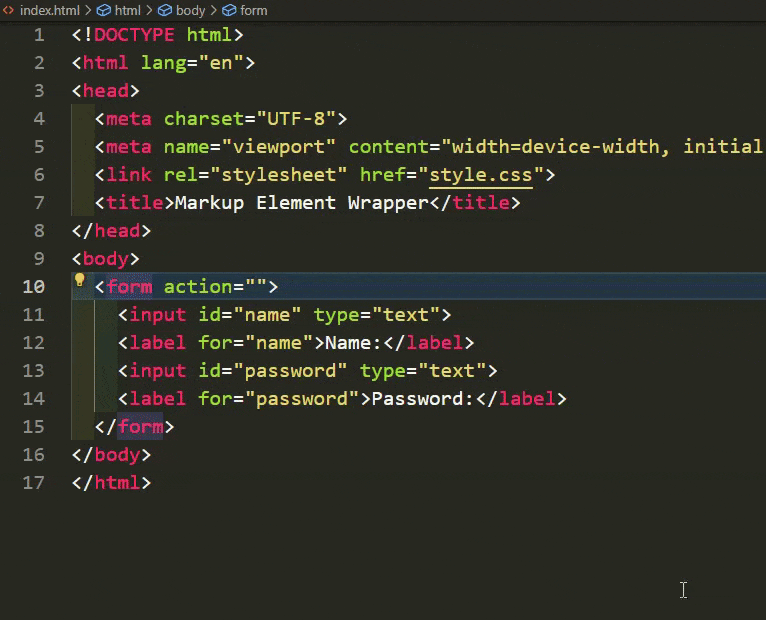

# Markup Element Wrapper

A Visual Studio Code extension that provides a convenient way to wrap elements for markup languages such as HTML, SVG, XML, embedded HTML, etc. It also allows you to remove elements from the tree and wrap selections.

## How to use

While placing the cursor inside the scope of the element you want to wrap/remove (anywhere between '<' of the opening tag and '>' of the closing tag), you can press `(CTRL+W)` to wrap the element, or `(CTRL+Shift+W)` to remove the element from the tree (without removing its content/children).  
Or you can select multiple lines/elements to group/wrap them inside another element, by using the same shortcut `(CTRL+W)`. 

For the full list of [commands](#features), you can use Code Actions `(CTRL+.)` then select a command.

## Features

All the following commands are registered as <b>Code Actions</b> for the Main supported markup language in a workspace (the language of the file you open first, such as .html, .vue, etc)   
Commands with keybindings are active for all [supported languages](#supported-languages)/filetypes.

- **Wrap with div**: Use the `ctrl+w` (or `cmd+w` on Mac) shortcut to wrap the selected element with a tag `div` (you can change this default tagname in Extension Settings).
- **Remove Element**: Use the `ctrl+shift+w` (or `cmd+shift+w` on Mac) shortcut to remove the selected element from the tree (without removing its content/children).
- **Wrap with different element**: This command allows you to wrap the selected element with a different tag.
- **Wrap Selection**: This command allows you to wrap the selected text with the specified tag.

You can optionally change Keybindings for this extension in VS Code: File > Preferences > Keyboard Shortcuts, then type the Extension name in the search bar

## Configuration

You can customize the behavior of the extension by modifying the following settings in the extension  Settings/settings.json file:

- `markup-element-wrapper.defaultWrappingElement`: Specify the default wrapping block element tagname (default is "div").
- `markup-element-wrapper.defaultClassName`: Specify the default class name for the wrapping element (default is "wrapper").
- `markup-element-wrapper.excludedWrappedElements`: A list of all excluded wrapped (non self-closing) elements (such as body, script, template, etc.).
- `markup-element-wrapper.excludedWrappedSelfClosingElements`: A list of all excluded wrapped (self-closing) elements (such as meta, link, etc.).

## Supported Languages

- html
- svg
- xml
- vue
- jsx
- tsx
- sve
- php
- erb

## License

This project is licensed under the terms of the MIT license. See the [LICENSE](LICENSE) file for details.